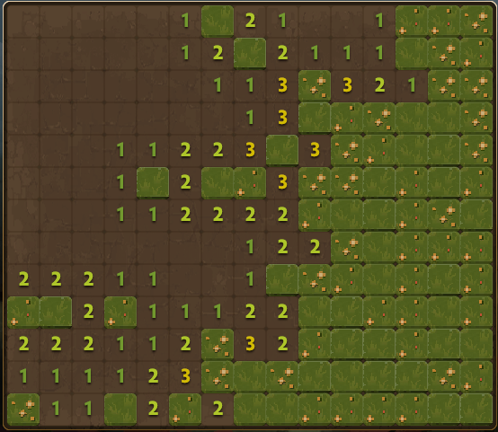

## Dota2 Minesweeper Game AI

This is an AI for the Minesweeper minigame embedded in Dota2 Crownfall Act 4. It uses image recognition to identify the board and performs actions based on algorithms.

It will help you beat the game. 

### Download
[Here](https://github.com/BurgerNight/Dota2-Minesweeper-AI/releases)

### Usage
1. Set Dota2 resolution to 1920x1080 (16:9) in borderless windowed mode
2. Go to the Minesweeper game page.
3. Run `run_agent.exe` as administrator.
4. Move the mouse over `Play` on game page, then press `b` to start.
5. When a level is finished, move the mouse over `Continue`, then press `b`
6. Use `q` to pause/unpause the program, use `esc` to exit the program.

### Q&A
1. Will it get you VAC banned?

    The program functions based on image recognition. It does not access or access any game files and should be safe to use.

2. After pressing `b`, it performs no action or random clicks

    The board was not recognized correctly. You can try replacing topLeft.jpg and botRight.jpg in the resource folder with your own screenshots, ensuring the center points of both images correspond to the top-left and bottom-right corners of the board.

3. Clicked on a mine or freezing when a level is not finished

    If the program runs normally most of the time, it’s likely that a cell number was not accurately recognized. Maybe try again.

4. Cleared all level, but the score wasn't enough.
   
    Try again.